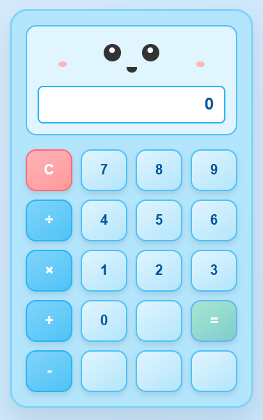

# Cute Baby Blue Calculator

A charming calculator with an animated face that responds to your calculations! This calculator features a cute blue design with blinking eyes and mouth animations.

In this workshop, you will learn how to use GitHub Copilot to enhance an HTML Calculator, with little to no coding experience required. Through guided exercises and AI-powered assistance, you'll add mathematical functions and discover how GitHub Copilot can accelerate your development workflow.




## Table of Contents
- [Current Features](#current-features)
- [How to Use](#how-to-use)
- [Adding Mathematical Functions](#adding-mathematical-functions)
    - [1. Core Exercise: Adding a Pi (π) Button](#1-core-exercise-adding-a-pi-π-button)
    - [2. Using Agent Mode for All Advanced Functions 🤖](#2-using-agent-mode-for-all-advanced-functions-🤖)
- [File Structure](#file-structure)
- [Advanced Customization Ideas](#advanced-customization-ideas)
- [Error Handling](#error-handling)


## Current Features

- Basic arithmetic operations (+, -, ×, ÷)
- Clear function
- Keyboard support
- Animated face with blinking eyes and mouth movements
- Responsive design
- Error handling for division by zero

## How to Use

1. Open `index.html` in your web browser
2. Click buttons or use your keyboard to perform calculations
3. Watch the calculator's face animate as you work!

### Keyboard Shortcuts
- Numbers: 0-9
- Operations: +, -, *, /
- Calculate: Enter or =
- Clear: Escape, C, or c

## Adding Mathematical Functions

The calculator is designed to be easily extensible. Below are detailed instructions for adding a Pi button, exponent, square root, and squared functions.

### 1. Core Exercise: Adding a Pi (π) Button

#### Step 1: Add the HTML Button
In `index.html`, find the empty button with the comment `<!--add pie button-->` and add the following code using GitHub Copilot:

```html
 <!--add pie button-->
<button class="btn number" data-value="π">π</button>
```

#### Step 2: Add the Pi Input Method
AIn `script.js`, find the comment `// Add pi input support to 5 decimal places` and the new method to the Calculator class:

```javascript
    // Add pi input support to 5 decimal places
    inputPi() {
    this.displayValue = Math.PI.toFixed(5).toString();
    this.waitingForOperand = false;
    }
```

#### Step 3: Update JavaScript to Handle Pi
In `script.js`, modify the `// Add support for pi` comment in the `handleInput` method to handle the π value. Add the condition after the existing number check:

```javascript
handleInput(value) {
    if (this.isNumber(value)) {
        this.inputNumber(value);
    // Add support for pi
    } else if (value === 'π') {
        this.inputPi();
    } else if (this.isOperator(value)) {
        this.inputOperator(value);
    } else if (value === '=') {
        this.calculate();
    } else if (value === 'clear') {
        this.clear();
    }
    this.updateDisplay();
    this.animateFace();
}
```

#### Step 4: Open the HTML calculator and Test
To verify the Pi button works, open `index.html` in your browser and click the π button. The display should show `3.14159`. Test calculations like `π + 2` to ensure it functions correctly.

---
### 2. Using Agent Mode for All Advanced Functions 🤖
You can also use GitHub Copilot's agent mode to implement all advanced functions at once:

1. Open the GitHub Copilot chat panel and set it to "Agent" mode.
2. Provide instructions for adding exponent (x^y), square root (√), and squared (x²):
   ```
   Add advanced mathematical functions to the calculator: exponent (x^y), square root (√), and squared (x²). 
   
   Not required, but you might need to add the following to your prompt to ensure all changes are made:
   - Add buttons for each function in the empty button slots
   - Exponent: Button labeled "x^y" with data-value="^", update isOperator method, add case in performCalculation
   - Square root: Button with "√" symbol, add inputSquareRoot method with error handling for negative numbers
   - Squared: Button labeled "x²", add inputSquared method using Math.pow()
   - Update handleInput method to handle all new operations
   - Ensure proper styling and functionality
   ```
3. The agent will implement all changes for you to review. Test the calculator thoroughly, and refine your agent mode prompt as needed.
4. Once satisfied, save the changes and test the new functions in your browser.

## Complete Modified Files

After implementing all changes, your button layout will look like this:

```
C  7  8  9
÷  4  5  6
×  1  2  3
+  0  π  =
-  √  x² x^y
```

## File Structure

```
├── README.md               # This file
├── assets/                 # Image assets
│   └── cute-calculator.png # Calculator screenshot
└── MyCalculator/           # Calculator application files
    ├── index.html          # Main HTML structure
    ├── script.js           # Calculator logic and animations
    └── style.css           # Styling and cute design
    └── LICENSE.txt         # License information
```

## Advanced Customization Ideas

- **Trigonometric functions**: Add sin, cos, tan buttons
- **Logarithms**: Add log, ln functions
- **Memory functions**: Add M+, M-, MR, MC
- **Scientific notation**: Enhanced display for very large/small numbers
- **History**: Keep track of previous calculations
- **Themes**: Add different color schemes

## Error Handling

The calculator includes basic error handling:
- Division by zero returns 0
- Square root of negative numbers shows "Error"
- Large numbers are displayed in scientific notation

## Browser Compatibility

This calculator works in all modern browsers that support:
- ES6 Classes
- CSS Grid/Flexbox
- DOM Event Listeners

Enjoy your enhanced cute calculator! 🧮✨